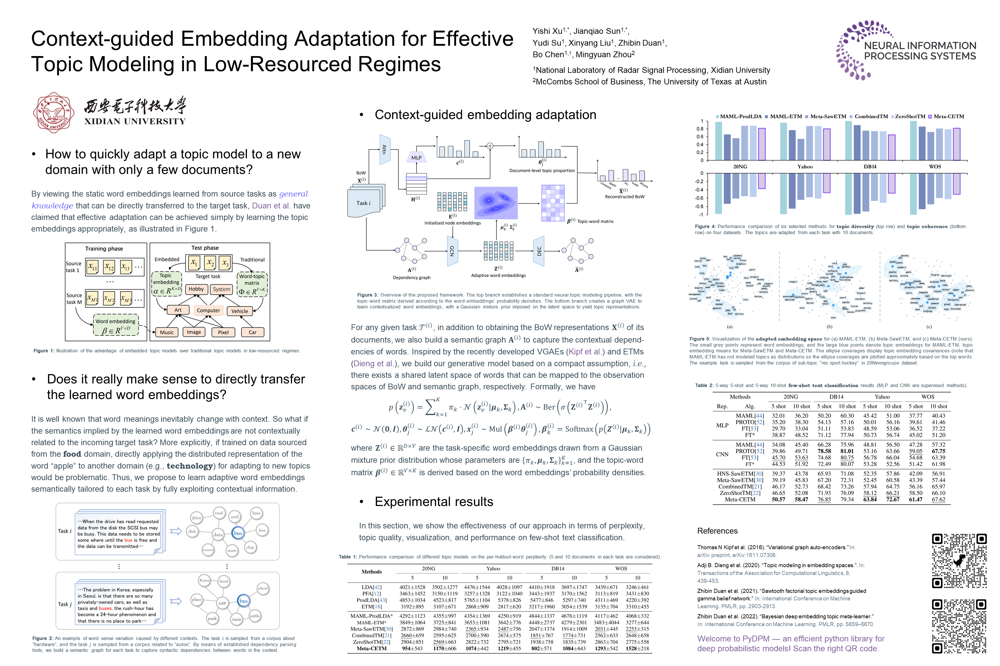

# Meta-CETM

<p align="center">
    <a href="https://github.com/jqsun98/Meta-CETM/"></a>
</p>

Official implementation of "**Context-guided Embedding Adaptation for Effective Topic Modeling in Low-Resource Regimes**" (NeurIPS 2023)

Authors: Yishi Xu<sup>1</sup>,  Jianqiao Sun<sup>1</sup>, Yudi Su<sup>1</sup>, Xinyang Liu<sup>1</sup>, Zhibin Duan<sup>1</sup>, Bo Chen<sup>\*1</sup>, Mingyuan Zhou<sup>2</sup> 

(\*Corresponding Author)

<sup>1</sup> **National Key Laboratory of Radar Signal Processing, Xidian University**

<sup>2</sup> **McCombs School of Business, The University of Texas at Austin**

# Quick Start

## Installation


```java
conda create -n meta_cetm python=3.8
conda activate meta_cetm
pip install -r requirements.txt
```

<details>
<summary>Click for more details </summary>

More details about the experiments for reproduction:
```bash
GPU: NVIDIA RTX 3090
Driver Version: 536.23
CUDA Version: 11.3
python: 3.8.12
torch: 1.11.0+cu113
```
</details> 

## Dataset Preparation

## Training & Testing
